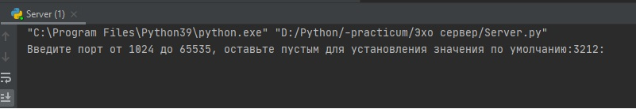
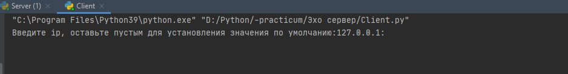
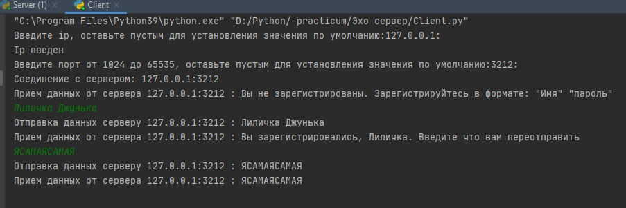
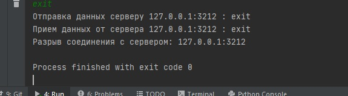
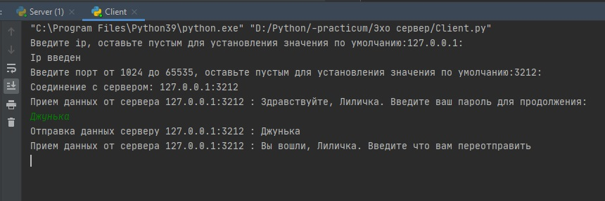
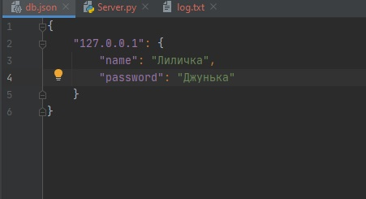

# Эхо сервер
### Лабораторная работа 3 «Эхо сервер».

Как работает программа:

Запускаем сервер, установили значение по умолчанию

Сервер запустился, далее работаем с клиентом, так же его запускаем устанавливая все значения по умолчанию 

 

Так как мы еще не проходили регистрацию, создаем нового пользователя

Далее пытаемся воспользоваться самим сервером и переполучить данные

Теперь демонстрируем функцию отключения от сервера

 

Переподключаясь видно, что, имея существующего пользователя остается только ввести пароль

Выключаем сервер

Вот как выглядят существующие пользователи    

